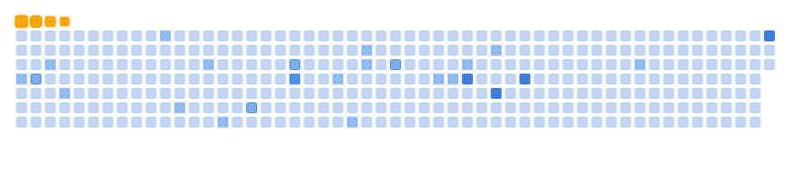

# Budi Amin

<!-- markdownlint-disable MD033 -->

  

  

  

## Tentang Saya

Saya suka membangun antarmuka yang rapi, aplikasi yang ringan dipakai, dan eksperimen yang membuat workflow jadi lebih efektif. Fokus saya sekarang adalah membuat profil ini lebih hijau, lebih bersih, dan lebih konsisten.

## Tech Stack

  
  
  
  
  
  
  
  

## Connect with Me

  
  
  
  
  

## Tools

  
  
  
  
  
  
  
  
  
  
  

